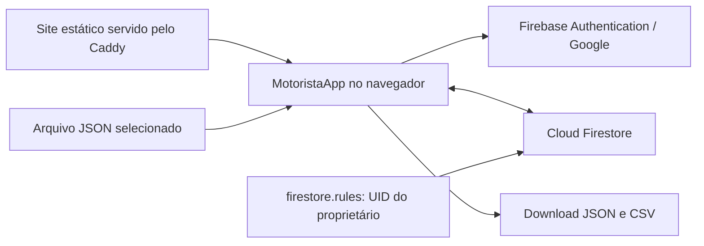

# Motorista — documentação da aplicação

Aplicação pessoal de controle financeiro para motorista, disponível na rota `/motorista` deste repositório. Permite registrar ganhos, gastos e dados de jornada, consultar o resultado por período e acompanhar uma meta de saldo mensal.

Esta documentação descreve a implementação presente no código em 05/10/2026, incluindo alterações locais ainda não commitadas. O [plano original](PLANO-MOTORISTA.md) descreve a intenção inicial; funcionalidades previstas ali podem diferir da interface atual. A configuração efetivamente publicada no Firebase e o comportamento do site em produção não foram verificados durante esta documentação.

## Acesso e organização

- Endereço de produção indicado pelo projeto: [hassa.dev.br/motorista](https://hassa.dev.br/motorista).
- Desenvolvimento: [localhost:3000/motorista](http://localhost:3000/motorista).
- Idioma da interface: português do Brasil; moeda: real brasileiro.
- Autenticação: conta Google, com acesso limitado ao UID do proprietário.
- Persistência: Cloud Firestore, compartilhada entre dispositivos autenticados.
- Conexão com a internet necessária para login, leitura e gravação.

A página fica fora da navegação do portfólio. Seus metadados usam `noindex`/`nofollow`, `public/robots.txt` bloqueia `/motorista` e a rota não aparece no sitemap. Essas configurações tratam indexação; a autorização dos dados depende das regras do Firestore.

## Guia de uso

### Entrar e navegar

Abra `/motorista`, clique em **Entrar com Google** e autentique a conta autorizada. O login abre um popup. Uma conta diferente pode autenticar no Google, mas recebe a mensagem **Esta conta não tem acesso aos dados** e não carrega os registros.

A navegação principal contém:

| Seção | Conteúdo atual |
| --- | --- |
| Início | Resultado do período, referência de meta, participação dos ganhos e gastos e estatísticas da jornada. |
| Ganhos | Ganhos agrupados por dia e edição dos dados de trabalho. |
| Gastos | Despesas agrupadas por dia, com criação, edição e exclusão. |
| Relatórios | Aba presente, mas seu conteúdo ainda está vazio. |

O avatar no cabeçalho abre o menu da conta, com **Definições**, **Exportar** e **Sair**. Definições reúne meta e categorias; Exportar também permite importar backups. Essas seções são estados internos do componente, sem URLs próprias. Ao recarregar a página, a navegação retorna ao Início e os filtros são reinicializados.

### Selecionar um período

Início, Ganhos e Gastos possuem filtros independentes. O padrão é a semana atual.

| Filtro | Abrangência |
| --- | --- |
| Dia | A data selecionada. |
| Semana | Semana ISO, de segunda-feira a domingo, inclusive. |
| Mês | Primeiro ao último dia do mês selecionado. |
| Personalizado | Data inicial e final, ambas incluídas. |

Datas inválidas ou um início posterior ao fim tornam o período inválido. Os registros ficam sem resultados e a interface solicita um período válido. A seleção não altera o que está salvo.

### Registrar ganhos

Em **Ganhos**, clique em **Registrar ganho**, informe data, origem (**Uber**, **99** ou **Outros**) e um valor positivo. Também há um atalho no Início. Novos cadastros começam na data atual do dispositivo, que pode ser alterada.

Existe um total por origem e data. Se Uber já tiver valor em determinado dia, outro cadastro de Uber para esse dia será recusado: edite o registro existente com o novo total. O cadastro não soma automaticamente dois lançamentos da mesma origem.

Os ganhos ficam agrupados por dia, do mais recente para o mais antigo. Cada ganho pode ser editado ou excluído; a exclusão pede confirmação. Na edição, é possível mudar valor, data ou origem. Se a combinação de destino já tiver valor, a alteração será recusada.

A gravação usa uma transação: ao mudar data ou origem, o valor anterior é zerado e o novo é gravado em conjunto. Ao excluir, apenas os campos daquela origem são zerados; os dados da jornada e os demais ganhos do dia permanecem.

Use **Outros** para ganhos externos aos aplicativos. A interface atual não oferece campo para quantidade de corridas, embora o modelo mantenha `uberRides` e `ninetyNineRides` por compatibilidade.

### Registrar dados do dia

Em **Ganhos**, clique em **Registrar dados do dia**, ou no ícone de edição dos dados de uma data existente. Informe:

- **Horas trabalhadas:** duração decimal, como `8,5` para 8 horas e 30 minutos.
- **KM rodados:** distância total, como `145,5`.
- **Consumo (km/L):** consumo informado para aquele dia, como `12,5`.

Os três valores são opcionais; campos vazios são salvos como zero. Aceitam números não negativos. Horas são convertidas para minutos inteiros com arredondamento. O consumo é informado manualmente, sem cálculo automático a partir dos gastos com combustível.

Salvar os dados do dia preserva os ganhos existentes. É possível registrar uma jornada sem ganhos. Um documento diário com todos os valores zerados permanece no Firestore, mas fica fora da listagem de Ganhos. Não há exclusão do documento diário pela interface.

### Registrar gastos

Em **Gastos**, clique em **Registrar gasto** e informe data, categoria, valor positivo e, opcionalmente, uma observação de até 500 caracteres. O botão de um grupo diário já preenche sua data.

Um dia pode ter vários gastos, inclusive sem jornada ou ganho registrado. Cada gasto tem ID próprio, pode ser editado e pode ser excluído após confirmação. O valor inteiro entra no resultado da data informada, sem rateio entre períodos.

As categorias iniciais são **Combustível**, **Manutenção**, **Alimentação**, **Pedágio**, **Estacionamento**, **Lavagem** e **Outros**. Em Definições é possível criar categorias e renomear as existentes. Nomes devem ser únicos, desconsiderando maiúsculas/minúsculas, e ter até 80 caracteres. Renomear preserva o ID e a associação dos gastos anteriores. Não existe exclusão de categorias na interface.

### Configurar a meta

No menu da conta, abra **Definições**, preencha **Meta mensal de saldo (R$)** com um valor positivo e salve.

A interface grava a meta no mês atual do dispositivo. Ela vale desse mês em diante até outra meta ser registrada. Ao consultar um mês, o sistema usa a meta positiva mais recente cuja data seja igual ou anterior ao mês consultado.

Por exemplo, uma meta salva em outubro continua valendo em novembro se não houver uma meta posterior. Alterar a meta novamente em outubro substitui a meta de outubro; salvar uma nova em novembro preserva a de outubro. A interface atual não possui seletor para editar metas de meses anteriores.

## Indicadores e regras de cálculo

Todos os indicadores do Início são calculados no navegador a partir dos registros carregados. Alterações recebidas pelo Firestore atualizam os cálculos.

### Resultado e jornada

| Indicador | Cálculo |
| --- | --- |
| Ganhos do período | Soma dos valores de Uber, 99 e Outros nas datas filtradas. |
| Gastos do período | Soma de todas as despesas nas datas filtradas. |
| Saldo | Ganhos menos gastos; pode ser negativo. |
| Participação de uma origem | Valor da origem dividido pelos ganhos totais × 100. |
| Participação de uma categoria | Gastos da categoria divididos pelos gastos totais × 100. |
| Horas trabalhadas | Soma dos minutos dividida por 60. |
| Ganho por hora | Ganhos divididos pelas horas trabalhadas. |
| KM rodados | Soma dos quilômetros informados. |
| Ganho por KM | Ganhos divididos pelos quilômetros. |
| Consumo médio | Média aritmética dos consumos diários maiores que zero. |

Ganhos por hora e por quilômetro mostram `—` quando o divisor é zero. O consumo médio também mostra `—` se nenhum dia tiver consumo positivo. A média de consumo não é ponderada pela distância nem pelos litros consumidos.

O saldo representa somente os valores registrados. Despesas ainda não lançadas ficam fora do cálculo.

### Meta do período e progresso mensal

A meta é de **saldo**, depois de descontar os gastos. Para estimar a referência do período, o código assume uma média de cinco dias de trabalho por semana:

```text
dias estimados do mês = arredondar(dias corridos do mês × 5 / 7)
dias estimados do trecho = arredondar(dias corridos do trecho × 5 / 7)
meta do trecho = meta mensal × dias estimados do trecho / dias estimados do mês
meta do período = soma das metas dos trechos, arredondada em centavos
falta = máximo(meta do período − saldo do período, 0)
```

O cálculo divide intervalos em trechos mensais e resolve a meta vigente para cada mês. Se algum mês não tiver uma meta positiva aplicável, a referência e o valor que falta aparecem como `—`.

O cartão **Meta** compara saldo filtrado e meta estimada do período. **% da meta do mês** usa o saldo do mês completo de referência, mesmo quando o filtro seleciona apenas um dia ou uma semana. Esse mês é o da data inicial do período; em uma semana que atravessa dois meses, será o mês da segunda-feira. Em um intervalo personalizado que atravessa meses, o percentual mensal fica sem valor.

O percentual textual pode ser negativo ou ultrapassar 100%. A barra visual é limitada ao intervalo de 0% a 100%.

**Particularidade do cálculo atual:** o arredondamento é feito para o intervalo inteiro. Assim, a soma das referências calculadas para dias isolados pode diferir da referência calculada para a semana completa. O cálculo trata o tamanho do intervalo, sem verificar quais dias da semana serão trabalhados.

`goalPlan()` em `lib/motorista.ts` contém cálculos de referência diária, semanal e necessidade diária restante, mas não é usado pela interface atual.

## Arquitetura e arquivos

O projeto usa Next.js com App Router, React, TypeScript e o SDK web do Firebase. O build gera um site estático (`output: "export"`); a aplicação Motorista executa no navegador e acessa Authentication e Firestore diretamente. O Cloudflare Worker do formulário de contato do portfólio não participa desse fluxo.



| Arquivo | Responsabilidade |
| --- | --- |
| [`app/motorista/page.tsx`](app/motorista/page.tsx) | Rota, título, SEO e cores do navegador. |
| [`app/motorista/layout.tsx`](app/motorista/layout.tsx) | Manifesto, ícones e configuração para tela inicial no iOS. |
| [`components/motorista/motorista-app.tsx`](components/motorista/motorista-app.tsx) | Login, estado, navegação, formulários, filtros, persistência e backups. |
| [`components/motorista/motorista.css`](components/motorista/motorista.css) | Estilos exclusivos, tema conforme preferência do sistema e adaptação ao celular. |
| [`lib/motorista.ts`](lib/motorista.ts) | Tipos, valores padrão, datas, cálculos, validação de backup e geração de CSV. |
| [`lib/motorista-firebase.ts`](lib/motorista-firebase.ts) | Configuração do Firebase, instâncias de Auth/Firestore e UID autorizado. |
| [`firestore.rules`](firestore.rules) | Regras de autorização das quatro coleções. |
| [`public/pwa/motorista.webmanifest`](public/pwa/motorista.webmanifest) | Identidade, início, escopo, modo de exibição e ícones do aplicativo. |
| [`next.config.ts`](next.config.ts) | Exportação estática, URLs sem barra final e imagens sem otimização em runtime. |
| [`.github/workflows/deploy.yml`](.github/workflows/deploy.yml) | Instalação, lint, build e publicação dos arquivos na VPS. |

### Carregamento e gravação

Após autenticar o proprietário, quatro assinaturas `onSnapshot` carregam integralmente `days`, `expenses`, `categories` e `goals` sob `users/{uid}`. A interface aguarda a primeira resposta das quatro coleções para mostrar as seções. As assinaturas são encerradas quando o efeito é desmontado ou a sessão muda.

Os filtros são aplicados em memória, sem consultas ao Firestore por intervalo. O volume de dados carregados cresce com todo o histórico.

As gravações usam `setDoc`, `deleteDoc`, transações para ganhos e lotes para gastos com criação de categoria ou importações. A interface indica carregamento, operação em andamento, sucesso e erro. Não há backend próprio nem API HTTP interna do Motorista.

## Modelo de dados

Todos os documentos ficam sob `users/{uid}`:

| Coleção | ID do documento | Campos |
| --- | --- | --- |
| `days` | Data `AAAA-MM-DD` | `date`, `uberCents`, `uberRides`, `ninetyNineCents`, `ninetyNineRides`, `otherCents`, `minutes`, `km`, `consumption` opcional. |
| `expenses` | UUID para novos cadastros | `id`, `date`, `categoryId`, `cents`, `note`. |
| `categories` | ID fixo das categorias padrão ou UUID | `id`, `name`. |
| `goals` | Mês `AAAA-MM` | `month`, `cents`. |

Valores monetários são armazenados em **centavos inteiros**: R$ 125,50 corresponde a `12550`. Durações ficam em minutos inteiros; distância e consumo admitem casas decimais. Datas são civis, sem horário, usando o calendário local do dispositivo. `exportedAt` no backup é um timestamp ISO.

O carregamento de um dia combina seus dados com `emptyDay()`, que fornece zero para campos ausentes. Documentos criados por gravações parciais podem conter somente parte dos campos diários.

`Gain` é uma representação para exibição e edição, derivada dos totais do dia por `legacyGains()`. Seus IDs são `legacy:{data}:{origem}`. **Não há coleção `gains` na persistência atual.**

Categorias padrão também existem no código e aparecem mesmo sem documento salvo. Ao cadastrar um gasto numa categoria padrão ainda não persistida, a aplicação grava categoria e gasto no mesmo lote. Uma categoria salva com o mesmo ID substitui o nome padrão na interface.

## Autenticação e segurança

O projeto configurado em `lib/motorista-firebase.ts` é `motorista-17946`. A aplicação usa `signInWithPopup` com `GoogleAuthProvider` e acompanha a sessão por `onAuthStateChanged`.

A interface só habilita o carregamento quando `user.uid === MOTORISTA_UID`. No Firestore, a função `owner(userId)` exige uma sessão autenticada, o UID fixo do proprietário e a correspondência com o `{userId}` do caminho. As regras permitem leitura e escrita apenas nas quatro subcoleções explicitamente declaradas.

A configuração web do Firebase é pública. A proteção dos registros é feita pelas regras do Firestore, inclusive contra acesso fora da interface. As regras locais atuais validam autorização, mas não validam campos, tipos ou valores dos documentos; essas validações estão nos formulários e no importador.

Para alterar o proprietário:

1. Obtenha o UID da conta desejada no Firebase Authentication.
2. Atualize `MOTORISTA_UID` em `lib/motorista-firebase.ts` e o UID da função `owner` em `firestore.rules`.
3. Publique as regras atualizadas no projeto Firebase correspondente.
4. Gere e publique novamente o site.

Os dados ficam associados ao UID antigo; trocar o UID autorizado não migra os registros. Se for necessário transferi-los, exporte o JSON com a conta antiga antes da troca e importe com a nova conta depois da configuração.

O README registra `localhost` e `hassa.dev.br` como domínios autorizados para o login. Confirme essa configuração no Firebase ao usar outro host. O repositório não contém configuração de emuladores nem um comando npm para publicar regras; o workflow do site não publica `firestore.rules`.

## Exportação e importação

Abra **Exportar** pelo menu da conta. JSON e CSV incluem **todo o histórico carregado**, independentemente dos filtros.

### Backup JSON

O arquivo baixado usa o nome `motorista-backup-AAAA-MM-DD.json`, versão atual `3`, com `exportedAt`, `days`, `expenses`, `categories` e `goals`. Inclui também as categorias padrão disponíveis na interface.

Exemplo válido de estrutura, com valores fictícios:

```json
{
  "version": 3,
  "exportedAt": "2026-10-05T18:00:00.000Z",
  "days": [{
    "date": "2026-10-05",
    "uberCents": 25000,
    "uberRides": 0,
    "ninetyNineCents": 8000,
    "ninetyNineRides": 0,
    "otherCents": 2000,
    "minutes": 480,
    "km": 150,
    "consumption": 12.5
  }],
  "expenses": [{
    "id": "exemplo-combustivel",
    "date": "2026-10-05",
    "categoryId": "combustivel",
    "cents": 7500,
    "note": "Abastecimento"
  }],
  "categories": [{ "id": "combustivel", "name": "Combustível" }],
  "goals": [{ "month": "2026-10", "cents": 500000 }]
}
```

### Restaurar ou combinar registros

1. Selecione um arquivo JSON.
2. Aguarde a validação e confira quantidades, data da cópia e coincidências por ID na prévia.
3. Escolha **Preservar existentes (importar só novos)**, padrão, ou **Atualizar itens com o mesmo ID**.
4. Clique em **Confirmar importação** e confirme o diálogo.

O modo preservar ignora documentos cujos IDs já estejam no estado carregado; não soma valores de um backup a um dia existente. O modo atualizar substitui o documento inteiro com o mesmo ID. Em ambos os modos, itens ausentes do arquivo permanecem salvos.

A validação aceita versões `1`, `2` e `3`. Na versão `2`, a lista adicional `gains` é validada e seus valores são somados aos campos diários correspondentes, produzindo um backup normalizado para versão `3`.

Limites e verificações:

- Arquivo de até 5.000.000 bytes.
- Até 10.000 itens somando as listas; na versão `2`, inclui os ganhos separados.
- Datas e meses válidos, valores não negativos e centavos/contagens/minutos como inteiros seguros.
- Ganhos separados da versão `2` com valor positivo e origem reconhecida.
- IDs de ganhos separados, gastos e categorias com 1 a 128 caracteres alfanuméricos, `_` ou `-`.
- Nomes de categorias preenchidos com até 80 caracteres e observações com até 500.
- Ausência de IDs duplicados dentro de cada lista; todo gasto precisa ter categoria correspondente no próprio backup.
- Somente campos reconhecidos em cada registro das listas. Diferentemente dos formulários, a validação admite gastos e metas com valor zero.

A importação grava lotes sequenciais de até 400 documentos. Cada lote é atômico, mas o arquivo inteiro não é: se um lote posterior falhar, os anteriores continuam gravados. A verificação de IDs existentes usa os dados carregados no início da operação, sem transação global entre dispositivos.

### CSV para planilhas

O arquivo `motorista-lancamentos-AAAA-MM-DD.csv` usa UTF-8 com BOM, separador `;`, campos entre aspas e linhas CRLF. As colunas são:

```text
tipo;data;categoria;descricao;valor_centavos;corridas;minutos;km;consumo_km_l
```

Existem linhas `ganho` para cada origem com valor positivo, uma linha `dados_do_dia` por registro diário e linhas `gasto` para despesas. Os valores monetários permanecem em centavos, sem formatação em reais. Categorias dos gastos são exportadas pelo nome atual. O CSV não contém metas nem serve como arquivo de restauração; a importação aceita somente JSON.

## Executar e publicar

Use Node.js 20.9 ou superior e npm. O workflow de produção usa Node.js 22. Na raiz do repositório:

```powershell
npm ci
npm run dev
```

Abra `http://localhost:3000/motorista`. Não há variável de ambiente específica para o Motorista: a configuração do Firebase está no código. `NEXT_PUBLIC_CONTACT_ENDPOINT` pertence ao formulário de contato do portfólio.

**O ambiente local usa o mesmo Firebase configurado para o site.** Não há isolamento automático: salvar ou excluir após autenticar a conta proprietária altera seus dados reais.

Comandos de verificação e geração:

```powershell
npm run lint
npx tsc --noEmit
npm run build
npx serve out
```

O build exporta `/motorista` em `out/motorista.html` e os demais recursos estáticos em `out/`. Sirva essa pasta por HTTP, com resolução de URLs sem extensão para o HTML correspondente. Embora exista o script `npm run start`, ele executa `next start`; o modelo de publicação deste projeto serve o export estático e não utiliza esse servidor.

O workflow [Deploy](.github/workflows/deploy.yml) roda em push para `master` ou acionamento manual. Executa `npm ci`, lint e build, depois publica o conteúdo de `out/` na VPS por SSH/rsync quando os secrets necessários estão configurados. As regras do Firestore são publicadas separadamente. Um deploy de arquivos estáticos não altera os dados persistidos no Firebase.

### Instalar no celular

O manifesto identifica `/motorista` como início e escopo e usa `display: "standalone"`. No Chrome, use a opção de instalação ou adicionar à tela inicial disponível no navegador. No Safari do iPhone, use **Compartilhar → Adicionar à Tela de Início**.

A aplicação possui ícones próprios. Não existe service worker nem configuração explícita de cache persistente do Firestore; a instalação não oferece uma garantia de uso offline. Login, consulta e salvamento exigem conexão.

## Diagnóstico

| Situação | O que conferir |
| --- | --- |
| Conta sem acesso | UID autenticado e `MOTORISTA_UID`; use a conta proprietária. |
| Popup não abre ou login falha | Permissão de popup, conexão, provedor Google habilitado e domínio autorizado no Firebase. |
| Falha ao carregar uma coleção | Mensagem exibida, regras publicadas, projeto Firebase e correspondência do UID no caminho. |
| Ganho recusado por duplicidade | Já há valor para a origem nessa data; edite o registro existente. |
| Jornada ou gasto salvo não aparece | Filtro da seção, data informada e mensagem de confirmação da gravação. |
| Meta ou percentual mostra `—` | Meta aplicável ao período e, no percentual, se o intervalo personalizado atravessa meses. |
| Ganho por hora/KM mostra `—` | Horas ou quilômetros zerados no período. |
| JSON recusado | Versão, tamanho, quantidade, IDs, valores e categorias referenciadas. |
| Importação falhou após iniciar | Lotes anteriores podem ter sido aplicados; confira os dados antes de repetir. |
| `/motorista` não abre no servidor estático | Publicação de `out/motorista.html` e resolução de `/motorista` para esse arquivo. |

## Limitações atuais em relação ao plano

- Relatórios não possui conteúdo; não há gráfico de evolução diária.
- Quantidade de corridas permanece no modelo e no CSV, mas não tem campo de cadastro nem indicador na interface atual. Excluir ou mover um ganho de Uber/99 também zera a contagem da origem anterior; a contagem não é transferida.
- A interface não mostra média por corrida, saldo por hora, saldo por quilômetro ou gasto por quilômetro.
- A meta é editada somente para o mês atual e herdada pelos seguintes. Referências diária/semanal e necessidade diária restante de `goalPlan()` não aparecem na tela.
- Não há exclusão de categoria, exclusão completa de jornada, paginação do histórico, importação CSV ou modo offline implementado.

Estas limitações descrevem o código consultado; não indicam que as etapas ou critérios de aceite do plano original tenham sido verificados em produção.
